<div align="center">

<p align="center">
  
</p>

[](https://eslint.org/)
[](https://vitest.dev/)
[](http://makeapullrequest.com)

</div>

---

## 📖 Overview

This document describes how to work with the codebase as a developer.

## 💻 Development Environment

> [!TIP]
> Follow these steps to set up your local development environment.

<details>
<summary><b>🚀 Quick Setup Guide</b></summary>

### 1️⃣ Clone the repository

```powershell
git clone https://github.com/your-org/valentine-code-hearts.git
cd valentine-code-hearts
```

### 2️⃣ Install dependencies

```powershell
npm install
```

### 3️⃣ Run the app

```powershell
npm run dev
```

> [!NOTE]
> Open http://localhost:8080 in your browser.

</details>

## 🧪 Running Tests and Checks

> [!IMPORTANT]
> Always run these checks before committing code!

```mermaid
graph LR
    A[💻 Code Changes] -->|Run| B[🔍 ESLint]
    B -->|Pass| C[🧪 Vitest]
    C -->|Pass| D[📦 Build]
    D -->|Pass| E[✅ Commit]

    style A fill:#4A90E2,stroke:#2c3e50,stroke-width:2px,color:#fff
    style B fill:#FFD93D,stroke:#2c3e50,stroke-width:2px,color:#333
    style C fill:#50C878,stroke:#2c3e50,stroke-width:2px,color:#fff
    style D fill:#B19CD9,stroke:#2c3e50,stroke-width:2px,color:#fff
    style E fill:#FF6B6B,stroke:#2c3e50,stroke-width:2px,color:#fff
```

<div align="center">



</div>

### ⚡ Quick Check Commands

```powershell
# 🔍 Lint
npm run lint

# 🧪 Tests
npm run test

# 📦 Build
npm run build
```

| Tool | Purpose | Config |
|------|---------|--------|
| 🔍 **ESLint** | Linting | `eslint.config.js` |
| 🧪 **Vitest** | Unit tests | `vitest.config.ts` |
| 📦 **Vite** | Build | `vite.config.ts` |

## 📜 Branch naming

Use short, descriptive branches:

| Prefix | Use for | Example |
|--------|---------|---------|
| `fix/` | Bug fixes | `fix/heart-counter-reset` |
| `feat/` | New features | `feat/export-card` |
| `docs/` | Documentation | `docs/readme-setup` |

## ✍️ Commit guidance

- Use clear, **present-tense** messages: e.g. *"Add card export"*, *"Fix counter overflow"*.
- One logical change per commit.

## 📋 PR checklist

- [ ] Code runs locally (`npm run dev`).
- [ ] Lint passes (`npm run lint`).
- [ ] Tests pass (`npm run test`).
- [ ] Build succeeds (`npm run build`).
- [ ] Changes are focused and documented as needed.

---

<div align="center">

## 🤝 Thank You for Contributing!

<p align="center">
  
</p>


**Questions? Open an issue or discussion!** 💬

</div>
